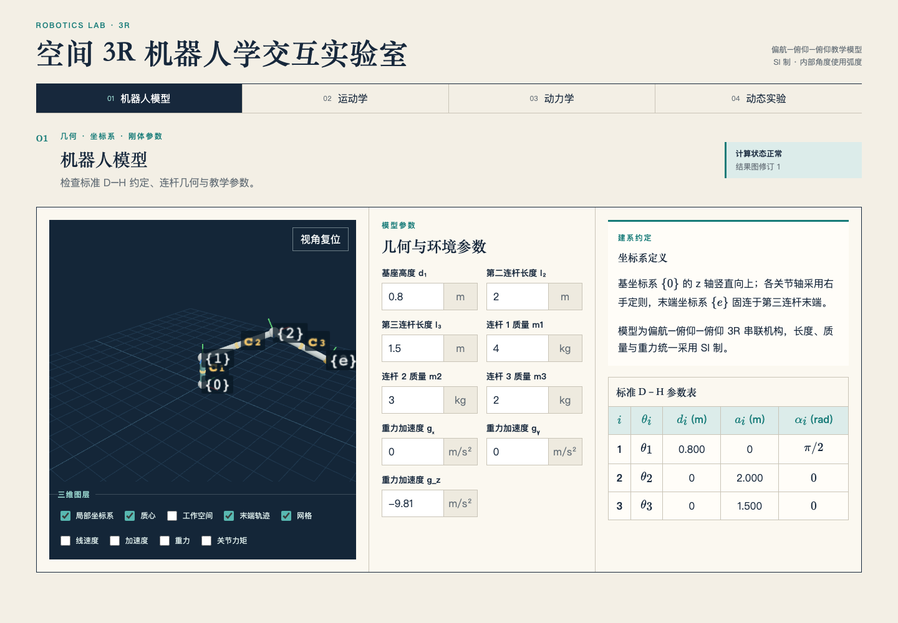

# 空间 3R 机器人学交互实验室

一个无需登录、完全在浏览器本地运行的中文机器人学教学应用。它围绕偏航–俯仰–俯仰空间 3R 串联机器人，将 3D 机构、公式、矩阵与时间响应放在同一个可编辑工作台中。

在线演示：[GitHub Pages](https://zaowenchen.github.io/planar-2r-simulator/)（仓库启用 Pages 后可匿名访问）



## 学习模块

- **机器人模型**：以毫米编辑连杆几何，查看标准 D–H 表、质量、重力和坐标系约定。
- **运动学**：以度和毫米联动关节角与末端位姿；17 步教学链明确区分 D–H 正运动学、解析几何逆运动学、正运动学回代和几何雅可比，并用奇异值、条件数、Yoshikawa 可操作度与逆条件数解释位置灵巧度。三维场景同步展示世界/连杆/末端坐标系、D–H 四段变换、工作平面、肘上/肘下幽灵构型、回代误差和姿态差异，二维图负责解释三角形关系。
- **动力学**：编辑质量、质心、惯量、重力与粘性摩擦，检查惯性矩阵、科氏项、重力项、力矩、能量和功率。
- **动态实验**：用五次多项式、梯形速度（抛物线过渡）或正弦轨迹做逆动力学，或以常值、阶跃、正弦、分段常值力矩做正动力学；动画、曲线与公式共享时间轴，可导出 CSV。

## 公式速览

标准 D–H 变换与整机变换为

$$ {}^{i-1}T_i=R_z(\theta_i)T_z(d_i)T_x(a_i)R_x(\alpha_i), \qquad {}^0T_3={}^0T_1{}^1T_2{}^2T_3. $$

末端位姿由位置和旋转矩阵共同组成：

$$ {}^0T_3=\begin{bmatrix}{}^0R_3&{}^0p_e\\0&1\end{bmatrix},\qquad \beta=\theta_2+\theta_3. $$

速度与刚体动力学模型为

$$ \begin{bmatrix}{}^0v_e\\{}^0\omega_e\end{bmatrix}=J(q)\dot q, \qquad
\tau=M(q)\ddot q+C(q,\dot q)\dot q+g(q)+B\dot q. $$

完整推导和实现对应关系见 [数学模型](docs/mathematics.md)，界面单位与内部单位的对应关系见 [符号表](docs/symbols.md)。

## 本地运行与验证

需要 Node.js 20.19 或更高版本，以及支持 WebGL 2 的桌面浏览器。

```bash
npm ci
npm run dev
```

浏览器访问 `http://localhost:5173`。完整验证：

```bash
npm test
npm run typecheck
npm run build
npx playwright install chromium
npm run e2e
python3 -m unittest discover -s legacy/python -p 'test_*.py'
```

推荐当前稳定版 Chrome、Edge 或 Firefox；Safari 需要支持 WebGL 2。CI 使用 Chromium 执行真实浏览器验收，并在 `main` 分支发布静态产物到 GitHub Pages。

## 数值方法与适用范围

- 运动学与机器人模型界面统一使用毫米和度；三角函数、动力学和数据导出的核心值仍使用米、弧度及其他 SI 单位。
- 逆运动学采用解析几何法：先把目标投影到竖直工作平面，由直角三角形求肩部—目标距离并检查可达性，再用余弦定理、目标方向角和三角形补偿角依次得到 `θ₃`、`γ`、`δ` 与 `θ₂=γ-δ`；每组解都展开正运动学回代位置、分量误差和实际姿态。
- 数值齐次变换只把平移列换算为毫米；运动学位置雅可比按 `mm/°` 显示，旋转块和角速度雅可比保持无量纲。
- 惯性矩阵由各连杆质心线速度/角速度雅可比构造；Christoffel 符号按精确定义组织，质量矩阵偏导用中心差分、默认步长 `1e-5 rad` 求值。
- 正动力学采用固定步长四阶 Runge–Kutta（RK4），允许步长 `0.001–0.02 s`；不提供自适应误差估计，不应用于实时控制或安全关键计算。
- 奇异性以位置雅可比块的奇异值判断；3D 箭头为便于辨认会归一化，真实量值在旁侧图例给出。
- 位置灵巧度同时给出 Yoshikawa 指标 $\mu=\prod_i\sigma_i$ 与逆条件数 $\eta=\sigma_{\min}/\sigma_{\max}$；前者反映位置速度椭球体积，后者反映方向均衡性。
- 梯形速度点到点轨迹使用各占总时长三分之一的加速、匀速和减速段，平台速度自动取平均速度的 $1.5$ 倍；各关节共享归一化时间以同步到达目标。
- 逆运动学是该偏航–俯仰–俯仰结构的解析解，并按关节限位过滤；不是任意机械臂求解器。

`legacy/` 保留早期 Python/Matplotlib 平面 2R 与空间 3R 演示及其测试，仅用于历史对照；当前产品入口是 React 应用。

## 参考项目

轨迹与灵巧度增强参考了 Peter Corke 等维护的 [Robotics Toolbox for Python](https://github.com/petercorke/robotics-toolbox-python) 的功能划分与公开数学定义；本项目针对固定空间 3R 教学模型以 TypeScript 独立实现，没有引入其 Python 运行时。对照范围、已采用内容和后续候选见 [参考仓库评估](docs/robotics-toolbox-reference.md)。参考项目采用 MIT License，具体版权与许可条件以其仓库为准。

## 许可与引用

当前仓库未附带开源许可证；默认保留所有权利。公开复用、分发或改编前请先取得作者许可。

课程作业、文章或演示可建议引用为：

> Chen, Zaowen. *空间 3R 机器人学交互实验室（Interactive 3R Robotics Lab）*. GitHub repository, 2026. https://github.com/ZaowenChen/planar-2r-simulator
